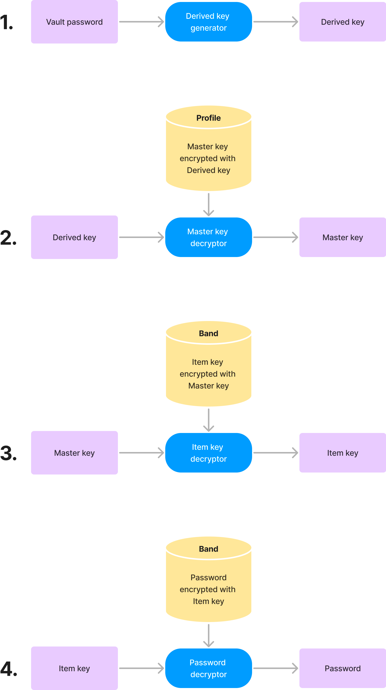
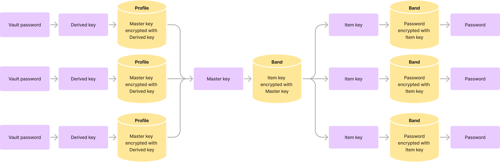

# Initial Questions
- How are they stored?
- If they're stored encrypted how am I able to search over them? Do they all get decrypted?
- If I wanted to give another use access to a password how does that work?
- How do vault password changes work? Do all the keys get recomputed?

## What I'm looking at
### https://support.1password.com/cs/opvault-design/
This is defining an old 1password file format, it looks really useful. 
They explain their rational for the data structure clearly. 
However, it's obviously written for someone who knows more about this than me, 
so I'm going to need to do some more research on what all these words mean.

There's several layers of key described in is, to the best of my knowledge
here's the keys and their relationships:

- Vault password (OK, this one isn’t a “key”).
- Derived encryption key.
- Master encryption key.
- Overview encryption key.
- Item encryption key (item specific).

Each of these also has a MAC (Still not certain what that is)

#### Vault password -> Derived encryption key
Derived key is produced from the vault password, using PBKDF2, the salt, and HMAC-SHA512. 
The first 256-bits are the derived encryption key and the remaining 256-bits are the derived MAC key

#### Master encryption key and Overview encryption key
These are very similar, master is more secure, overview is less.
They are generated randomly when they keychain is created.

Overview key encrypts the overview of each folder / item, but would require further decryption to get passwords
Master key is what actually encrypts passwords.

I'm hoping as long as I keep the store small I can ignore overview key's existence, 
this feels like a performance optimization which I don't need to care about so much (at least I don't think I do). 

#### Derived encryption key -> Master encryption key
The master key is encrypted with the derived key. This is how the vault is decrypted.

#### Master encryption key -> Item encryption key
Master keys encrypt an item specific key, the item specific key then encrypts the password

Here's my understanding of how the process works

And here's a loose entity relationship

## Outro
I feel like this gives me a clear understanding of roughly what I'm doing

#### How are they stored?
Using keys on keys on keys. Complicated but I can see the rationale behind it.

#### If they're stored encrypted how am I able to search over them? Do they all get decrypted?
Think this is done with the overview key, an easy decrypt for the simple stuff to search over, 
then a bigger decrypt for the actual important stuff.

#### If I wanted to give another use access to a password how does that work?
Still don't know this, I have a few guesses but no certainty yet, I can see how multiple users
have access to the same vault and maybe individual items use a similar process. I don't think this spec
supports this, so I'll probably have to do some more reading

#### How do vault password changes work? Do all the keys get recomputed?
This is simple now I know, the master key stays the same, what changes is the profile file which has
an encrypted version of the master key using the derived key.
